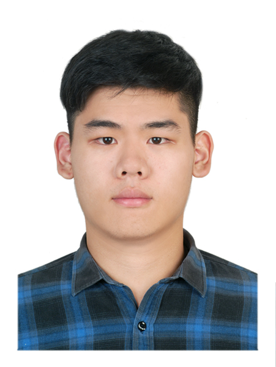
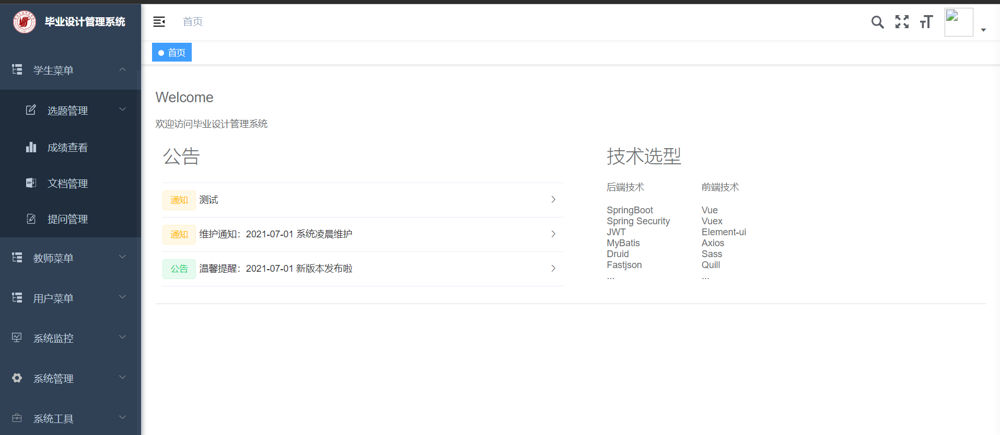

<!DOCTYPE html PUBLIC "-//W3C//DTD XHTML 1.1//EN" "http://www.w3.org/TR/xhtml11/DTD/xhtml11.dtd">
<html xmlns="http://www.w3.org/1999/xhtml" xml:lang="en">
<head>
<meta name="generator" content="jemdoc, see http://jemdoc.jaboc.net/" />
<meta http-equiv="Content-Type" content="text/html;charset=utf-8" />
<link rel="stylesheet" href="jemdoc.css" type="text/css" />
<title>Rui-Yang Ju</title>
  
  

  
</head>
<body>
<!--menu part-->

 <a href="#home">Home</a>
<a href="#research>Research</a> 
<a href="#exchangeexperiences">Exchange Experiences</a>  
<a href="#journals">Journals</a> 
<a href="#conferences">Conferences</a> 
<a href="#patents">Patents</a>
<a href="#awards">Awards</a> 

 

 

<h1>Rui-Yang Ju</h1>

<!--Head, shown in table form-->
<table class="imgtable"><tr><td>
&nbsp;</td>
<td align="left">
<a href="./">Rui-Yang Ju 鞠睿陽</a> 
<!--<i> 标签显示斜体文本效果。-->
  <i> Bachelor </i>
  
<!--<a href="https://github.com/RuiyangJu">[Github]</a> -->
<a href="./cv.pdf">[CV]</a>

 

Email: <a href="mailto:jryjry1094791442@gmail.com" target="_blank"><i>jryjry1094791442</i>&nbsp;&#64<i>gmail</i>&nbsp;&middot <i>com 
</i>&nbsp; 
</a>

</td></tr></table>

<h2>About Me</h2>

  Rui-Yang Ju is currently studing (2019-present) in Division of Electronics and Information Engineering, Department of Electrical and Computer Engineering from <a href="https://www.tku.edu.tw/">Tamkang University (TKU), Taiwan</a>, advised by <a href="http://www.ee.tku.edu.tw/teachers/%E6%B1%9F%E6%AD%A3%E9%9B%84/">Prof. Jen-Shiun Chiang.

  

<h2>Research</h2>
<ul>
  <li>I am now working on RNA 3D structure prediction, a funamental and exciting problem! Isn't it?</li>
  <li>I organized a self-learning group, where we share fundamental CS knowledge and cutting-edge researches. <a href="https://github.com/pengzhangzhi/self-taught-CS">Check here to join us</a>.</li>
  
  <li>I gave a talk about my paper on traffic flow prediction, <a href="https://www.bilibili.com/video/BV1db4y1J76q?spm_id_from=333.999.0.0">check here, starting at 40:50.</a></li>
<li>My work instructed by Prof. Chen is submitted to <B>IJCAI 22</B>. <a href="./Spatial_temporal_Transformer_Network_with_Self_supervised_Learning_for_Traffic_Flow_Prediction.pdf">Preprint version.</a>
  Code is released at <a href="https://github.com/pengzhangzhi/spatial-temporal-transformer">github</a>.</li>

<li>Received remote guidance from Prof. Chen, The Hong Kong University of Science and Technology.</li>
</ul>

<!-- Project -->

<h2>Publications</h2>
<table class="imgtable">

<!-- paper entry-->

<tr>
<!-- <td>&nbsp;</td> -->
<td>

Spatial-temporal Transformer Network with Self-supervised Learning for Traffic Flow Prediction. 

<u><b>Zhangzhi Peng</b></u>, Haibo Zhang, Hao Chen. 
<!-- preprint.  -->
[<a href="./Spatial_temporal_Transformer_Network_with_Self_supervised_Learning_for_Traffic_Flow_Prediction.pdf">preprint.</a>]  </td>
</tr>
  
<!--
<tr>
<td>&nbsp;</td>
<td>

Semi-Supervised Learning by Augmented Distribution Alignment. 

Qin Wang, &nbsp;<u><b>Wen Li</b></u>,&nbsp;Luc Van Gool. 
IEEE International Conference on Computer Vision</i>(<b>ICCV</b>),2019 (<b>oral</b>). 
[<a href= "https://arxiv.org/pdf/1905.08171.pdf">Paper</a>] [<a href="https://github.com/qinenergy/adanet">Code</a>] 
 </td>
</tr>

<tr>
<td>&nbsp;</td>
<td>
 Improving Web Image Search by Bag-based Re-ranking 

 Lixin Duan, <b><u>Wen Li</u></b>, Ivor W.H. Tsang, and Dong Xu.  
IEEE Transactions on Image Processing </i>(<b>T-IP</b>), vol. 20(11), pp. 3280-3290, NOV 2011.  
[<a href="./papers/Duan_TIP2011.pdf">PDF</a>]
</td>
</tr>
-->

</table>
  

<h2>Work Experience</h2>

<ul>
  <li>Research interns instructed by <a href="https://intersun.github.io/">Prof. Sun</a>, 2022/3 - now. We worked on RNA 3D Structure Prediction.</li>
  <li>Research interns instructed by <a href="https://cse.hkust.edu.hk/~jhc/">Prof. Chen</a>, 2021/5 - 2022/1. We worked on Fraffic Flow Prediction.</li>

</ul>

 <!-- Project -->

<h2>Open Source Porject</h2>
<table class="imgtable">

<!-- project entry-->

<tr>
<td>&nbsp;</td>
<td>

keras4torch, A compatible-with-keras wrapper for training PyTorch models. 

<u><b>Zhangzhi Peng</b></u>, blueloveTH. 
[<a href= "https://github.com/blueloveTH/keras4torch">Github</a>] 
 </td>
</tr>

  <tr>
<td>&nbsp;</td>
<td>

Dating box, A website for users to exchange contact. 

<u><b>Zhangzhi Peng</b></u>. The website is full-javascript. This project have been depolyed for three weeks and recivied over 400 times of register. 
[<a href= "https://github.com/pengzhangzhi/dating_box">Github</a>] 
 </td>
</tr>

  
  
    <tr>
<td>&nbsp;</td>
<td>

Graduation-project-topic-management-system. 

<u><b>Zhangzhi Peng</b></u>. This project is written in the separation of front-end and backend manner. Front-end: vue, and element-ui. Backend: springboot. 
[<a href= "https://github.com/pengzhangzhi/Graduation-project-topic-management-system">Github</a>] 
 </td>
</tr>
</table>
  
  

  
<!-- Services -->
<!--

<h2>Services</h2>

Workshop Organizers: 

<ul>
<li>
Co-organizer of CVPR 2020 Workshop on Visual Understanding by Learning from Web Data. 
</li>
<li>
Co-organizer of ICCV 2019 Workshop on Transferring and Adapting Source Knowledge (TASK) in Computer Vision (CV). 
</li>
<li>
Co-organizer of CVPR 2019 Workshop on Visual Understanding by Learning from Web Data. 
</li>
<li>
Co-organizer of ECCV 2018 Workshop on Transferring and Adapting Source Knowledge (TASK) in Computer Vision (CV). 
</li>
<li>
Co-organizer of CVPR 2018 Workshop on Visual Understanding by Learning from Web Data. 
</li>
<li>
Co-organizer of ICCV 2017 Workshop on Transferring and Adapting Source Knowledge (TASK) in Computer Vision (CV). 
</li>
<li>
Co-organizer of CVPR 2017 Workshop on Visual Understanding by Learning from Web Data. 
</li>
<li>
Co-organizer of ECCV 2016 Workshop on Transferring and Adapting Source Knowledge (TASK) in Computer Vision (CV). 
</li>
<li>
Co-organizer of ICDM 2015 Workshop on Practical Transfer Learning. 
</li>

</ul>

Conference Reviewer: 

 <ul><li>CVPR2020, ICLR2020, ICML2020, AAAI2020, ICCV2019, CVPR2019, NIPS2019, ICML2019, BMVC2019, ACM-MM2018, ECCV2018, ICIP2018, CVPR2018, ACM-MM2017, ICIP2017, ICCV2017, CVPR2017, ECCV2016, ICIP2016, NIPS2015, IJCAI2015, ICIP2015, ICME2014, ICME2013, IJCAI2013, ACM-MM2013.</li></ul>

Journal Reviewer:  

 
<ul>
<li>IEEE Transactions on Pattern Analysis and Machine Intelligence (T-PAMI)</li>
<li>International Journal of Computer Vision (IJCV)</li>
<li>Journal of Machine Learning Research (JMLR)</li>
<li>IEEE Transactions on Image Processing (T-IP)</li>
<li>IEEE Transactions on Information Forensics & Security (T-IFS)</li>
<li>IEEE Transactions on Neural Networks and Learning Systems (T-NNLS)</li>
<li>IEEE Transactions on Circuits and Systems for Video Technology (T-CSVT)</li>
<li>IEEE Transactions on Systems, Man, and Cybernetics: Part B (T-SMC-B)</li>
<li>Computer Vision and Image Understanding (CVIU)</li>
<li>ACM Transactions on Multimedia Computing, Communications and Applications (ACM TOMM)</li>
<li>Pattern Recognition (PR)</li>
<li>Pattern Recognition Letters (PRL)</li>
<li>Machine Vision and Applications (MVAP)</li>
<li>Signal Processing (SP)</li>
</ul>
</li>

</ul>
-->
  
  
  

<!-- Teaching -->
<!-- 
<h2>Teaching</h2>

<ul>
  
<li>None.</li>

</ul> -->

  <!-- Teaching -->

<!-- Awards -->

<h2>Awards</h2>
 
<ul>
<!--<li>Academic Model Scholarship 2020</li>-->
<li>Second-class Student Scholarship 2021. </li>
<li>Third-class Student Scholarship 2020. </li>

</ul>
  
    <!-- Misc -->

<h2>Misc</h2>

<ul>
<li>
  
I am siginficantly facilitated by some open courses, which shaped my professional skills and researches. <a href= "/self-taught">Check here.</a>  

  </li>
  
  <li>
  
<a href= "/album">Album</a> 

  </li>
  <li>
  
CET-4: 578, and CET-6: 543. 

  </li>

</ul>
  
  
  

All Rights Reserved. Part of page is generated by <a href="http://jemdoc.jaboc.net/">jemdoc</a>.

</body>
</html>

